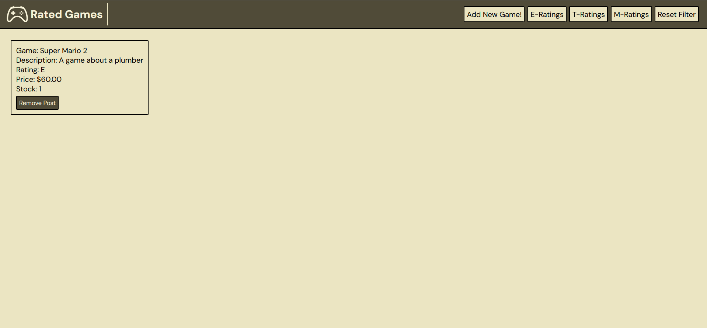
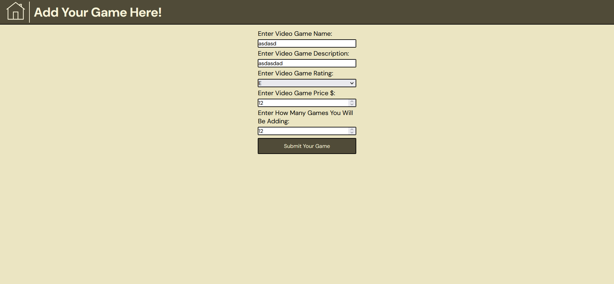

# Installation
For those who would like to run the application and/or edit its source code on their local computer, follow the steps below:

1. Clone the repository with `git clone https://github.com/Jaime-Sanz/Inventory-Application` or download it as a .zip file and extract it.

# Usage
A simple inventory application that allows users to post their video games, following The Odin Project.

# Learning Focus
The main focus of this project was to gain experience in database usage along with form handling and validation.

# Preview

| Shopping Page |
| --- |
|  |

# Built Using
> 

# Contributing
Feel free to submit an issue should a bug be found using the application.

# License
[MIT License](https://github.com/Jaime-Sanz/Shopping-Cart/blob/main/LICENSE)
# Contact Info
> Send a message by clicking on the icon!
> 
> 
